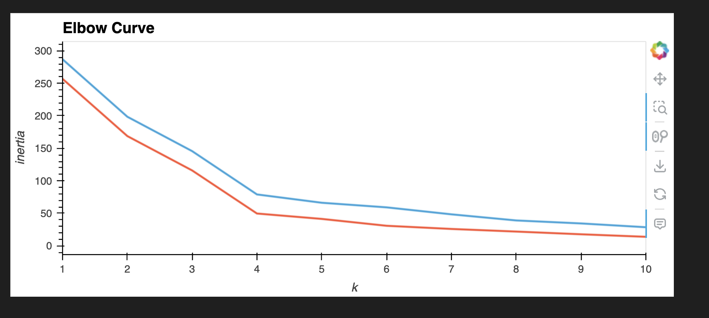
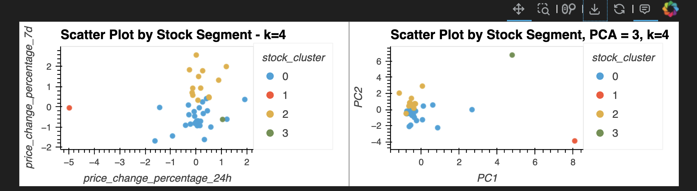

***Module 19 Challenge***

# Crypto Clustering

In this challenge, we used our knowledge of Python and unsupervised learning to predict if cryptocurrencies are affected by 24-hour or 7-day price changes.

This project applies K-Means clustering and Principal Component Analysis (PCA) to analyze cryptocurrency market data. The goal is to group cryptocurrencies based on their price trends and compare clustering results with and without PCA dimensionality reduction.

The Elbow method suggests that k=4 is the best number of clusters for both the original dataset and the PCA-transformed dataset
- The overall cluster structure remains similar before and after applying PCA.
- The main difference is that inertia is higher in the original dataset, meaning that the clusters are more spread out.
- PCA helped in reducing dimensionality, making the clusters visually clearer and reducing inertia (i.e., the clusters became more compact).

- Without PCA, clustering is affected by noise, leading to overlapping clusters.
- With PCA, clusters become more distinct, but some information is lost.
- The trade-off is between clarity vs. accuracy in clustering.

## Technologies used in assignment:
- Python
- Pandas
- hvPlot
- Scikit-learn (K-Means, PCA)
- HoloViews
- Bokeh
- Matplotlib